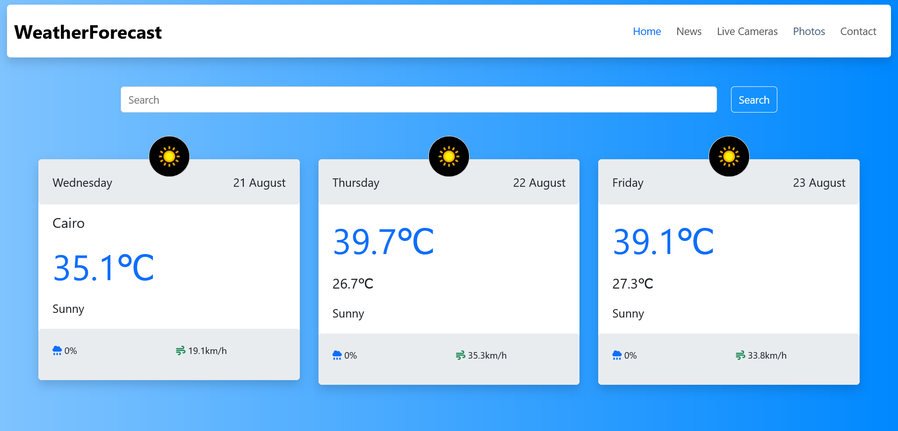

# Weather Forecast Application

The Weather Forecast Application is a simple web-based app that allows users to search for weather conditions in various locations. It includes a user-friendly interface with a responsive design, powered by Bootstrap, and provides up-to-date weather information.

## Table of Contents
- [Design](#design)
- [Features](#features)
- [Technologies Used](#technologies-used)
- [Getting Started](#getting-started)
- [Links](#links)
- [Author](#author)

## Design

## Features
- Responsive navbar with links to different sections.
- Search functionality to find weather forecasts for specific locations.
- Dynamic content display for weather results.
- Integration with weather data APIs (not included in the provided code but implied for functionality).

## Technologies Used
- **HTML5**: Markup language used for structuring the content.
- **CSS3**: For styling the application, including Bootstrap for responsive design.
- **JavaScript**: To handle user interactions and API requests (expected in `main.js`).
- **Bootstrap**: A framework used for building responsive, mobile-first web pages.

## Getting Started
To get a local copy up and running follow these simple steps:

### Prerequisites
- A modern web browser (Chrome, Firefox, Safari, etc.)
- Basic understanding of HTML, CSS, and JavaScript.

## Links

- **Repo**: [Github Repo](https://github.com/basemsameh/Weather-Forecast.git)
- **Demo**: [Live URL](https://basemsameh.github.io/Weather-Forecast/)

## Author

- **Name**: [Basem](Basem)
- **GitHub**: [GitHub Profile](https://github.com/basemsameh)
- **Linkedin**: [Linkedin](https://www.linkedin.com/in/basem-sameh-671b5b212/)